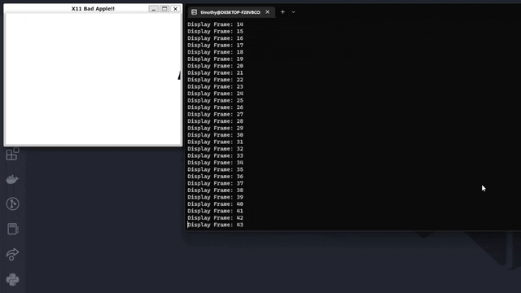

# X11-Bad-Apple
Bad Apple!! using X11 Graphics. Written in C++

## Demo (Realtime)

Demo run on local linux server with 30ms frame-to-frame delay.
*(if running on a remote server, you may want to remove this delay)*
## Usage

```bash
git clone git@github.com:Ti1mmy/X11-Bad-Apple.git X11-Bad-Apple
cd X11-Bad-Apple/src
make

./X11-Bad-Apple
```
* Note that you will have to have X11 installed (and an X11 server running) for this to work.
    * On Ubuntu, you can install X11 with `sudo apt install libx11-dev`
    * I suggest Xming on Windows, but you can use any X11 server.

## How it works
This program represents each frame as a 2D array of (black and white) pixels. The program interprets each frame, which make up a `Video` class which is what is ultimately printed.

See [scripts](./scripts/) for more information on how the frames are generated automatically using ffmpeg and Python.
## Plans
The code currently suffers from the way frames are read into memory. I plan to fix this by using a different method of storing the frames. I have a few ideas, but I'm open to suggestions.

| Speed | Branch         | Frame Storing Method                                                                         | Reasoning                                                                                                                   | Drawback                                                                                                                                                                    |
|-------|----------------|----------------------------------------------------------------------------------------------|-----------------------------------------------------------------------------------------------------------------------------|-----------------------------------------------------------------------------------------------------------------------------------------------------------------------------|
| `#1`  | [char-array](https://github.com/Ti1mmy/X11-Bad-Apple/tree/char-array)     | Stores pixel data as a char, with each line being a string.                                  | Very easy to read, and `std::string` is very useful                                                                         | Stores way too much data per pixel (1 byte) when I really only need black or white (1 bit, or 1/8 of a byte). Stack size limited when running the full 720p upscaled video. |
| `#2`  | [heap-allocate](https://github.com/Ti1mmy/X11-Bad-Apple/tree/heap-allocate)  | Stores string arrays on the heap instead of waiting for them to be initialized on the stack. | Theoretically allows for each frame to be allocated in seperate chunks in memory, meaning arbitrarily large video playback. | Requires creating vectors on the heap, which have some overhead resulting in very long compile times.                                                                       |
| `#3`  | [enum-scale-up](https://github.com/Ti1mmy/X11-Bad-Apple/tree/enum-scale-up)  | Stores pixel data as a one-bit `enum` (hoped to solve the issue from char-array)             | Saves each black and white pixel as a 1 bit enum, meaning only 1/8 of the memory is needed.                                 | Requires initializing large arrays that don't seem to be currently playing well. I look to improve this.                                                                    |
| `?`   | some-other-fix | [Open a PR!](https://github.com/Ti1mmy/X11-Bad-Apple/pulls)                                                                                   |                                                                                                                             |                                                                                                                                                                             |
